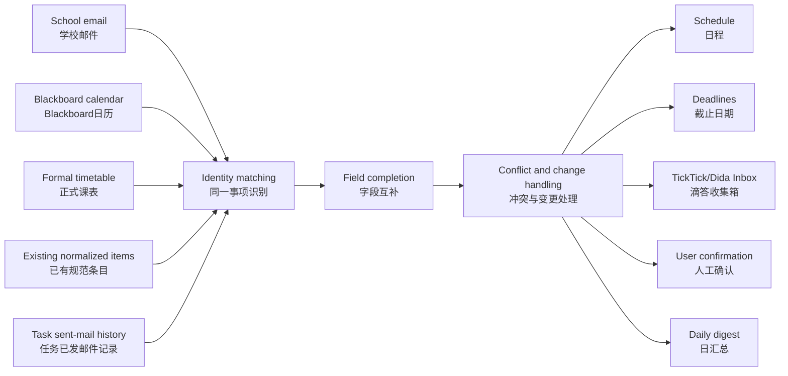
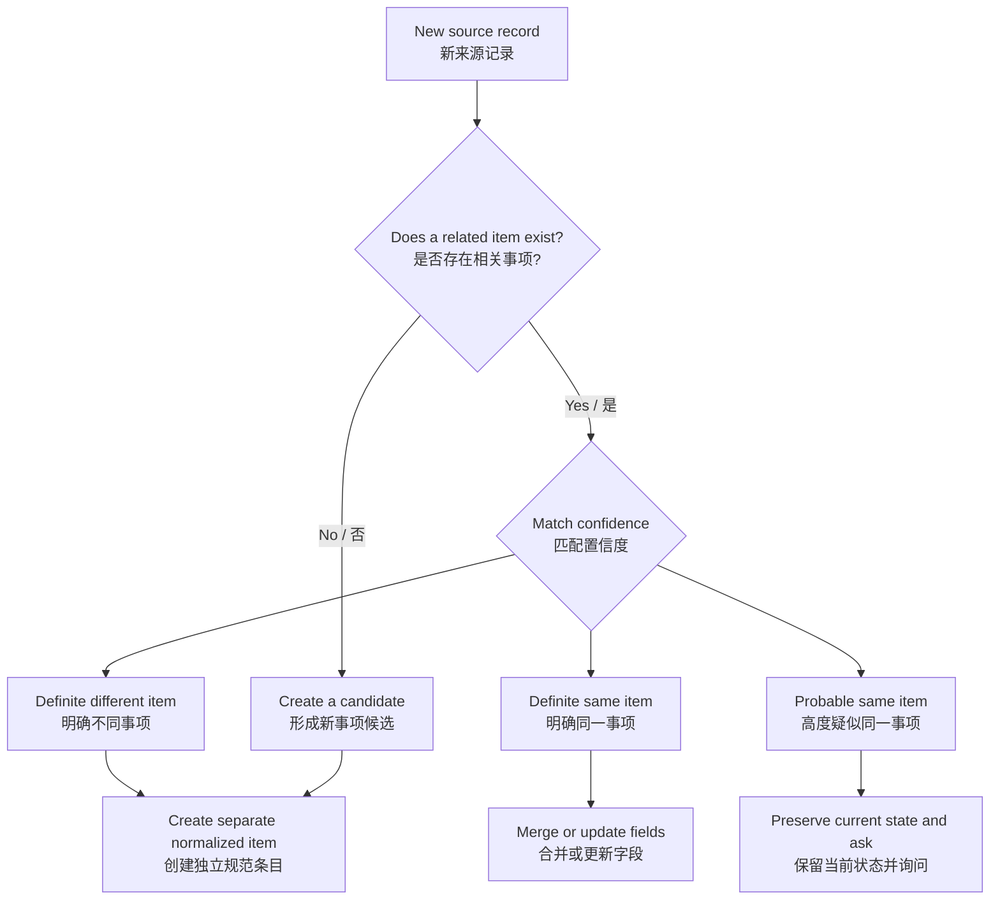
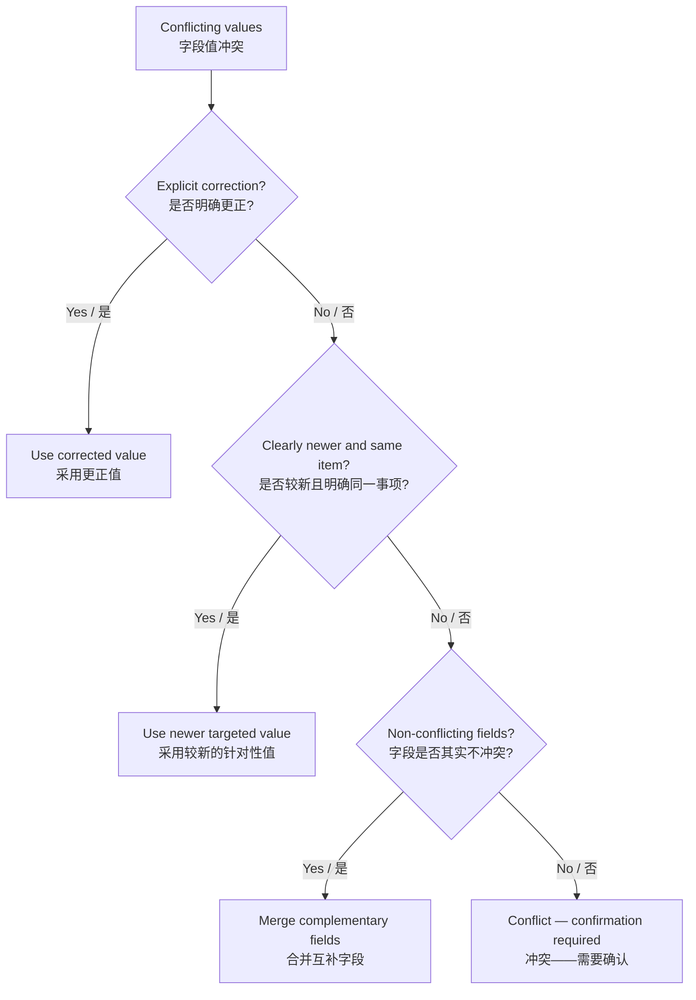
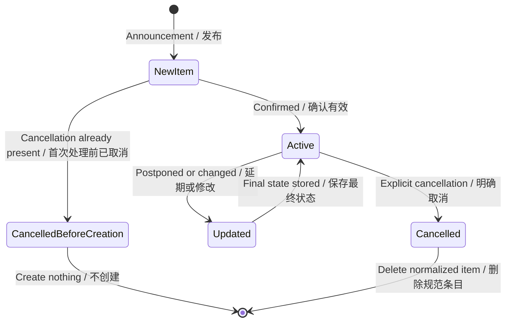
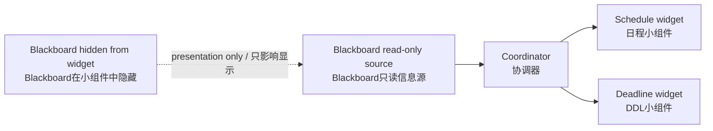

# Workflow Diagrams / 工作流图

The diagrams below use bilingual labels so that the logic can be understood without switching documents.

以下流程图使用中英双语标签，无需切换文档即可理解逻辑。

## 1. Overall data flow / 总体数据流

## 2. Decision before writing / 写入前决策

## 3. Authority by field / 按字段判断权威性

## 4. Change-chain handling / 变更链处理

## 5. Home-screen presentation / 桌面显示层

Hiding Blackboard from the widget does not disable it as a source. Unsubscribing from it does.

在小组件中隐藏 Blackboard 不会停用该信息源；取消订阅才会。
